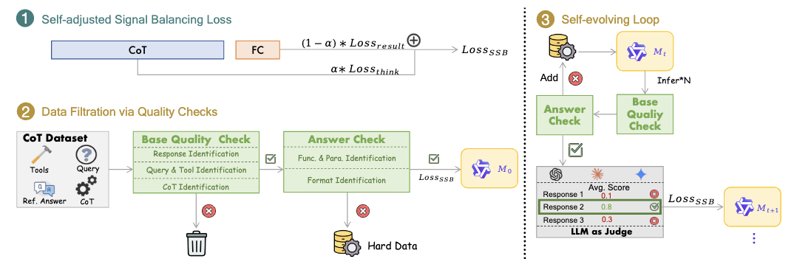

# BalanceSFT: Improving LLM Function Calling with Balanced Training Signals and Data Hardness

<p align="center">
         &nbsp&nbsp🤗 <a href="https://modelscope.cn/models/hbg400/Open-Agentic-tool-use">Dataset</a>&nbsp&nbsp | &nbsp&nbsp🤗 <a href="https://huggingface.co/Bingguang/FunReason">Model</a>&nbsp&nbsp | &nbsp&nbsp 📑 <a href="https://arxiv.org/pdf/2505.20192">Paper</a> &nbsp&nbsp ｜ &nbsp&nbsp📖 <a href="https://github.com/BingguangHao/FunReason">Github</a>
</p>

> [!IMPORTANT]
> 
> - **We have released our training dataset!**
> 
> - **We will release the code, waiting the confidential review of Ant Group.**
> 
> - **Please give a ⭐️ to follow the update which is also an incentive for us.**


## Abstract

> While Supervised Fine-Tuning (SFT) is the prevailing method for equipping Large Language Models (LLMs) with function calling capabilities, its effectiveness is often compromised by two critical challenges: 1) **Imbalanced Training Signals**, where lengthy Chain-of-Thought (CoT) reasoning tokens dominate the training signals over concise function calls in the learning objective, and 2) **Imbalanced Data Hardness**, characterized by a scarcity of hard training examples. To overcome these limitations, we propose Balanced Supervised Fine-tuning (**BalanceSFT**), a novel framework incorporates two key components: a Self-adjusted Signal Balancing (SSB) loss that employs a learnable hyperparameter to dynamically adjust the token contributions of CoT reasoning and function calls, together with a Hard Data Re-sampling (HDR) strategy that establishes a feedback loop to selectively generate new, high-quality complex data guided by model errors. Extensive experiments demonstrate the effectiveness of our proposed BalanceSFT framework. With BalanceSFT, a 7B model achieves function calling performance on par with state-of-the-art giants like GPT-4o. Our code, models, and dataset are open-sourced.
>

## BalanceSFT

<p align="center">

</p>

**Overview of BalanceSFT's data refinement pipeline.**  It starts with a standard function call dataset, which is refined through a Base Quality Check and Answer Check to create initial training data and identify hard data. The model is first initialized via a Cold Start using the Self-adjusted Signal Balancing (SSB) Loss. Subsequently, the Hard Data Re-sampling (HDR) strategy creates a Self-evolving Loop where the model iteratively reasons on hard cases, generates new solutions, and undergoes quality-gated retraining.

**We have released all the data that refined in this process, whcih contains high quality CoT data for function call.**


## Main Result
<p align="center">

</p>


<p align="center">

</p>


## Citation
```md
@article{FunReason,
  title={FunReason: Enhancing Large Language Models' Function Calling via Self-Refinement Multiscale Loss and Automated Data Refinement},
  author={Bingguang Hao, Maolin Wang, Zengzhuang Xu, Cunyin Peng, Yicheng Chen, Xiangyu Zhao, Jinjie Gu, Chenyi Zhuang},
  journal={arXiv preprint arXiv:2505.20192},
  year={2025}
}
```
